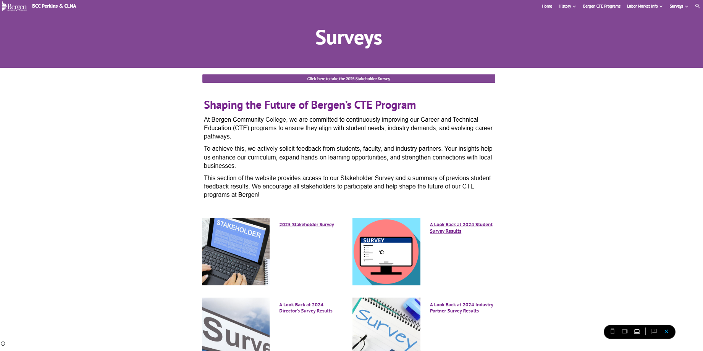

# CLNA Website Management & Data Visualization Project

As part of my role as Research Analyst at Bergen Community College, I took over management of the **CLNA Google Site**, a private website accessible to invited stakeholders attending CLNA meetings. The site serves as a central resource for sharing information about the college’s Career and Technical Education (CTE) programs and Perkins V activities.

## Purpose of the website
The CLNA Google Site provides stakeholders with:
- Information about Perkins V funding and priorities
- Access to meeting materials, reports, and resources
- Links to student, faculty, and stakeholder surveys
- Data on CTE job growth and labor market trends

## My contributions
- Took ownership of maintaining and updating the CLNA Google Site
- Enhanced the site by creating and embedding **static data visualizations** summarizing student, faculty, and stakeholder survey feedback
- Produced static visuals for both the **previous CLNA cycle** and the **current cycle** with updated survey results
- Used **Python** to automate cleaning and formatting of SurveyMonkey data, creating a streamlined process so that future survey data can be efficiently processed and turned into visuals for the website

*Screenshot: The Surveys section of the CLNA Google Site, where stakeholders access survey links and summaries of feedback results.*

## Tools used
- **Python** — Data cleaning, formatting, and preparation of SurveyMonkey survey results
- **SurveyMonkey** — Survey deployment and raw data collection
- **Google Sites** — Website content management and updates
- **Excel / charts tools** — Creation of static visuals to summarize survey results

## Code Sample: Automated Visualization Generator
To streamline reporting and support transparency, I developed a Python script that automates the generation of summary charts from survey data. These visualizations are embedded on the CLNA Google Site to give stakeholders a quick, accessible view of student, faculty, and stakeholder feedback.

📄 [View the full script → `survey_chart_generator_demo.py`](./survey_chart_generator_demo.py)

Notes
- This repository does not contain actual survey data, website content, or student responses due to confidentiality.
- Synthetic examples of visuals and cleaned data structures can be provided as portfolio samples.
